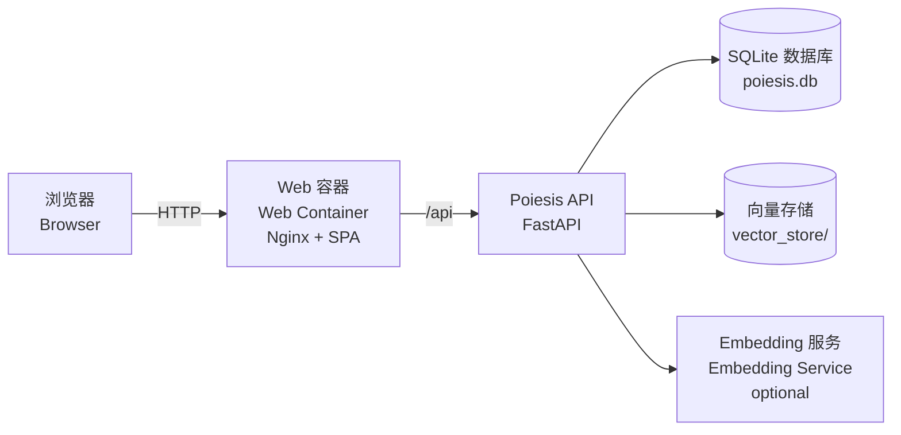
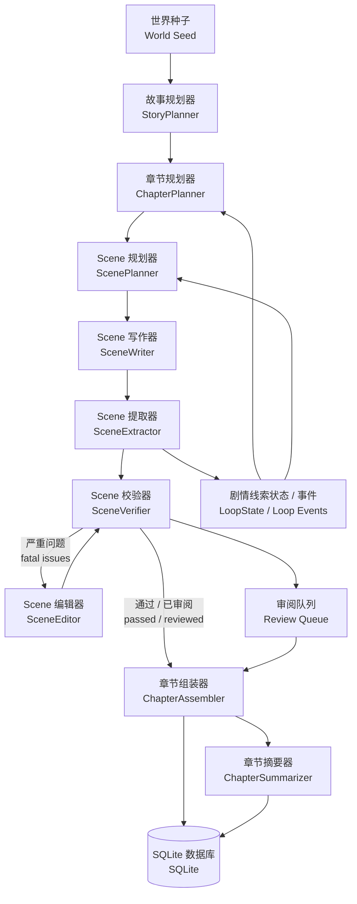

# Poiesis / 长篇叙事生成引擎
### Scene-Driven Narrative Generation Workspace / Scene 驱动叙事工作台

<p align="left">
  
  
  
  
  
</p>

> 自托管的 AI 小说生成与审阅工作台，当前主架构已切换为 `Scene 优先`。

Poiesis 是一个面向长篇小说、连载叙事和系列化内容生产的生成系统。它不再围绕“整章一次性黑盒生成”展开，而是采用 `story -> chapter -> scene` 的显式编排链路，把规划、生成、验证、审阅和发布拆成可追踪、可回放、可人工接管的步骤。

当前版本的重点不是“单次出稿快”，而是“多章节持续一致、可审计、可运营”。系统内置 Web Console、FastAPI、SQLite、向量检索和 Scene Review Queue，可用于个人创作，也可作为团队化内容生产底座继续扩展。

---

## ✨ Why Poiesis / 为什么选择 Poiesis

### 项目定位

Poiesis 面向希望长期稳定产出叙事内容的创作者与开发者，核心价值是：

- 以故事状态和 loop 管理为中心，而不是堆 Prompt。
- 让生成链路可诊断、可观测、可重跑。
- 让异常 scene 进入 review，而不是直接污染最终发布结果。
- 支持完全自托管，便于二次开发与私有化部署。

### 当前解决的问题

- 跨章节设定漂移
- 时间线断裂
- 伏笔和剧情承诺缺少显式状态
- 章节内部大黑盒难以局部修补
- 生成过程不可回放，问题难定位

### 当前技术栈

- Backend: FastAPI + Pydantic + SQLite
- Frontend: React + TypeScript + Vite
- Pipeline: StoryPlanner -> ChapterPlanner -> ScenePlanner -> SceneWriter -> SceneExtractor -> SceneVerifier -> SceneEditor -> ChapterAssembler -> ChapterSummarizer
- Review Flow: 自动通过为主，异常 scene 进入 `Review Queue`
- Deployment: Docker Compose，本地开发与 CI smoke 均已验证

---

## 🏗️ Architecture / 系统架构

### System Topology / 系统拓扑



### Scene-Driven Generation Flow / Scene 生成流程



### Core Runtime Concepts / 运行时核心概念

| 概念 | 说明 |
|---|---|
| `run` | 一次生成任务，包含多个 chapter |
| `chapter` | 章节级目标与 scene 聚合结果 |
| `scene` | 当前系统的一等执行单元 |
| `loop` | 故事承诺、伏笔或未闭合叙事线 |
| `review` | 对异常 scene 的人工处理队列 |
| `canon` | 当前世界事实快照，只用于展示与约束 |

---

## 🖥️ Current UI / 当前控制台

- `/` 仪表盘
- `/runs` Run Board （运行面板）
- `/runs/:runId` Scene Run Detail （运行详情）
- `/reviews` Review Queue （审阅队列）
- `/loops` Loop Board （剧情线索面板）
- `/canon` Canon Explorer （世界设定浏览器）
- `/chapters` 已发布章节列表
- `/settings` 系统设置

---

## 🚀 Quick Start (Docker) / 快速开始（Docker）

### 1. 📦 准备

```bash
git clone https://github.com/djmacdtr/Poiesis.git
cd Poiesis
cp .env.example .env
mkdir -p data
```

建议在 `.env` 中至少设置：

- `POIESIS_SECRET_KEY`
- `POIESIS_ADMIN_PASS`

### 2. ▶️ 启动

```bash
docker compose pull
docker compose up -d
```

### 3. ✅ 验证

```bash
docker compose ps
curl -f http://127.0.0.1:18000/health
curl -f http://127.0.0.1:18000/openapi.json > /dev/null
curl -f http://127.0.0.1:18080/health
curl -f http://127.0.0.1:18080/openapi.json > /dev/null
```

### 4. 🌐 打开系统

- Web: `http://127.0.0.1:18080`
- API: `http://127.0.0.1:18000`

首次使用建议流程：

1. 登录（默认用户名 `admin`，密码见 `.env` 中 `POIESIS_ADMIN_PASS`）
2. 在系统设置配置 `OpenAI / Anthropic / SiliconFlow` Key
3. 初始化世界
4. 在 `Run Board` 选择书籍与章节数，启动新的 scene run
5. 如有 fatal scene，转到 `Review Queue` 处理

---

## 🎛️ Deployment Modes / 部署模式

| Mode | Command | Use Case |
|---|---|---|
| `local` | `docker compose up -d` | 默认模式，轻量启动 |
| `remote` | `docker compose --profile full up -d` | 启用远程 embedding 服务 |

如需启用完整 embedding 模式，可在 `.env` 中设置：

```dotenv
POIESIS_EMBEDDING_PROVIDER=remote
POIESIS_EMBEDDING_URL=http://embed:9000
```

---

## 🛠️ Development / 开发说明

首页不展开 CLI、本地联调和开发细节，统一查阅以下文档：

- 开发总文档：`docs/developer_guide.md`
- 前端文档：`frontend/README.md`

---

## 🧯 Common Issues / 常见问题

- Web 打得开但 API 报错：先检查 `http://127.0.0.1:18000/health`
- 启动 run 报缺少 Key：到系统设置或环境变量补齐对应 provider 的 API Key
- Review Queue 没数据：说明当前 scene 都自动通过，未触发 fatal issue
- Loop Board 为空：说明当前 run 还没提取到 loop 更新

---

## 🤝 Contributing / 参与贡献

1. Fork 仓库并创建功能分支
2. 新增功能前先在 issue 里描述需求和设计方案，等待讨论
3. 代码提交前至少运行：
   - `ruff check poiesis tests`
   - `mypy poiesis`
   - `pytest`
   - `cd frontend && npm run build`
4. 所有新增和重构代码请补充适量中文注释，重点解释职责边界与数据流
5. 提交 PR，描述变更内容和动机，等待审阅

---

## 📄 License / 开源协议

本项目采用 GNU AGPLv3 协议。

GNU AGPLv3. See `LICENSE`.
