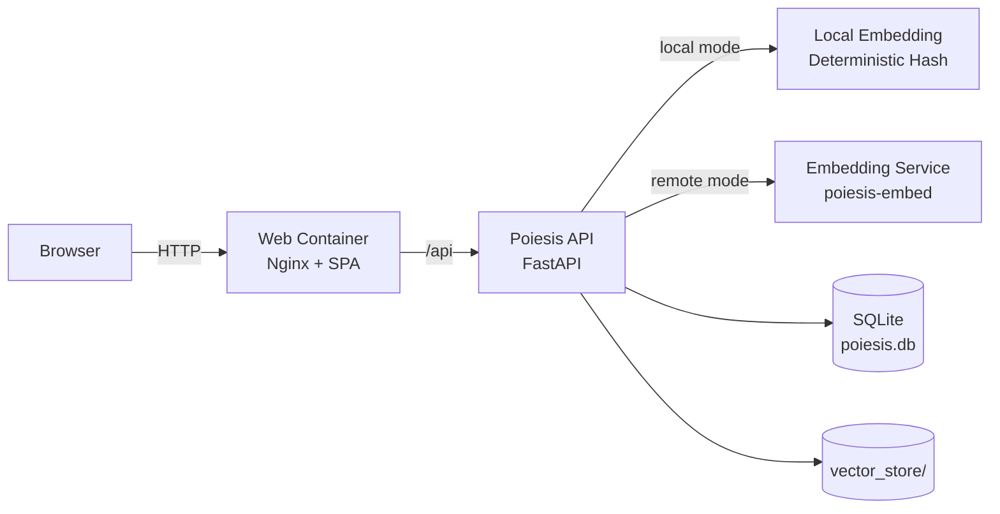
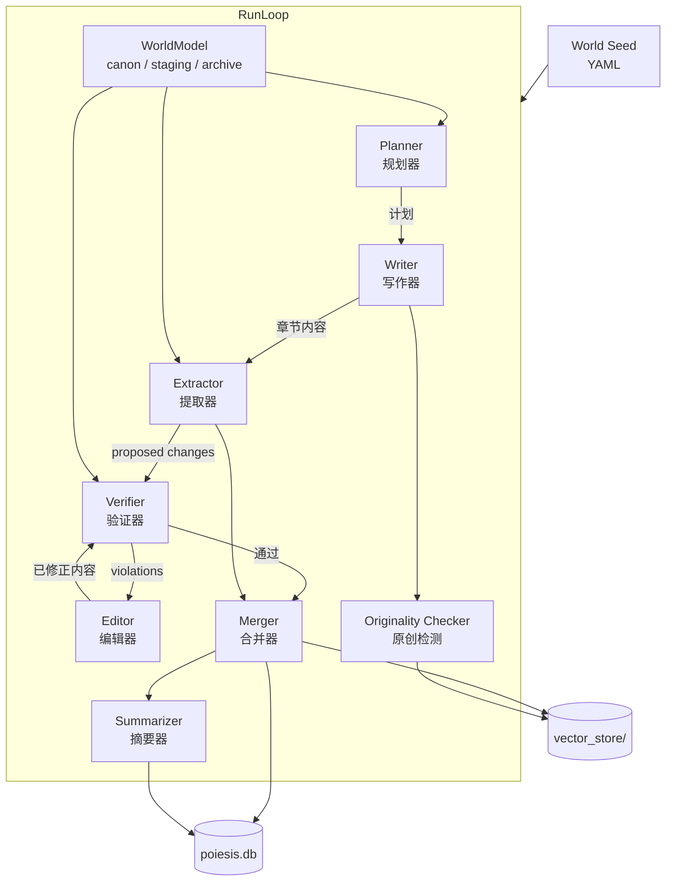

# Poiesis

> 自托管长篇叙事生成引擎（Web Console + API + Optional Embedding Service）

Poiesis 用于自动生成连贯、自洽的长篇小说：
- 用 LLM 生成章节内容（Plan -> Write -> Verify -> Edit）
- 跨章节维护世界观一致性（角色/规则/时间线/伏笔）
- 通过 staging 审批机制，将“新事实”可控地合并到 canon

## Why Poiesis

- 一致性优先：不是一次性文本生成，而是持续世界模型管理
- 可运营：内置 Web 控制台、运行状态、审批流、统计页
- 可部署：默认轻量模式，按需切换真实语义 embedding
- 可扩展：模块化 pipeline，支持 OpenAI/Anthropic

## Architecture

### System Topology



### Generation Pipeline (RunLoop)



### Three-Layer World Model

| 层级 | 内容 | 可变性 |
|---|---|---|
| `canon` | 已审批的权威世界事实 | 追加 / 更新 |
| `staging` | 来自新章节的待审改动 | 待审核 |
| `archive` | 已拒绝的改动及原因 | 不可变审计日志 |

## System Requirements

### 轻量模式（local embedding）最低配置

| 资源 | 最低要求 |
|---|---|
| CPU | 2 核 |
| 内存 | 2 GB |
| 磁盘 | 2 GB（镜像约 550MB + 数据目录） |

### 完整模式（remote embedding + embed 服务）推荐配置

| 资源 | 推荐配置 | 最低可用 |
|---|---|---|
| CPU | 4 核 | 2 核（较慢） |
| 内存 | 8 GB | 4 GB（可能较慢或 OOM） |
| 磁盘 | 10 GB | 含镜像约 3.5GB + 模型缓存约 90MB + 数据目录 |

## Quick Start (Docker)

### 1. Prepare

```bash
git clone https://github.com/djmacdtr/Poiesis.git
cd Poiesis
cp .env.example .env
mkdir -p data
```

### 2. Start (lightweight mode, default)

```bash
docker compose pull
docker compose up -d
```

### 3. Verify

```bash
docker compose ps
curl -I http://127.0.0.1:18080/
curl -I http://127.0.0.1:18080/api/openapi.json
```

### 4. Open Console

- Web: `http://127.0.0.1:18080`
- API: `http://127.0.0.1:18000`

首次进入建议流程：
1. 登录（默认账号 `admin`，密码见 `.env` 的 `POIESIS_ADMIN_PASS`）
2. 在系统设置配置 OpenAI/Anthropic Key
3. 初始化世界（UI 或 CLI）
4. 在 Run 页面设置章节数并启动任务

## Deployment Modes

| Mode | Command | Use Case |
|---|---|---|
| `local` (default) | `docker compose up -d` | 快速启动、低资源、离线可用 |
| `remote` (semantic) | `docker compose --profile full up -d` | 需要真实语义检索与更好的一致性 |

完整模式需要在 `.env` 中设置：

```dotenv
POIESIS_EMBEDDING_PROVIDER=remote
POIESIS_EMBEDDING_URL=http://embed:9000
```

## Local Development (Minimal)

```bash
# Backend
pip install -e ".[dev]"
poiesis serve --config config.yaml

# Frontend
cd frontend
npm install
npm run dev
```

## Documentation

- Developer Guide: `docs/developer_guide.md`
- Frontend Guide: `frontend/README.md`
- Docker Topology: `docker-compose.yml`
- API Smoke Test: `scripts/smoke_test_api.py`

## Common Issues

- `/api` 返回 502: 确认 `api` 容器健康且 `web` 能解析服务名 `api`
- 运行任务报缺少 Key: 在系统设置或 `.env` 补齐 LLM Key
- 完整模式不可用: 使用 `--profile full` 启动并检查 `embed` 健康状态

更多排障细节见项目文档与脚本注释。

## Contributing

欢迎 PR。

```bash
pip install -e ".[dev]"
pre-commit install
pytest
```

详细贡献与扩展指引请见 `docs/developer_guide.md`。

## License

Apache-2.0. See `LICENSE`.
