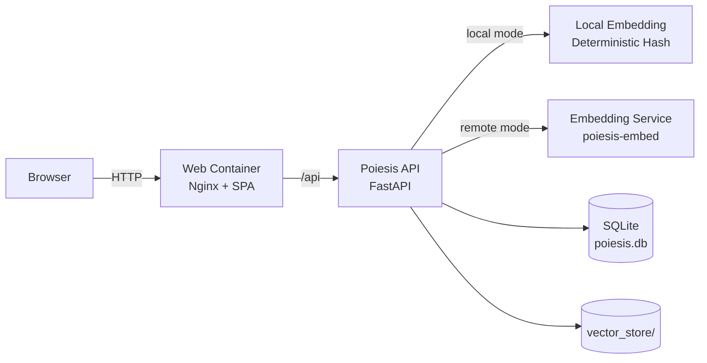
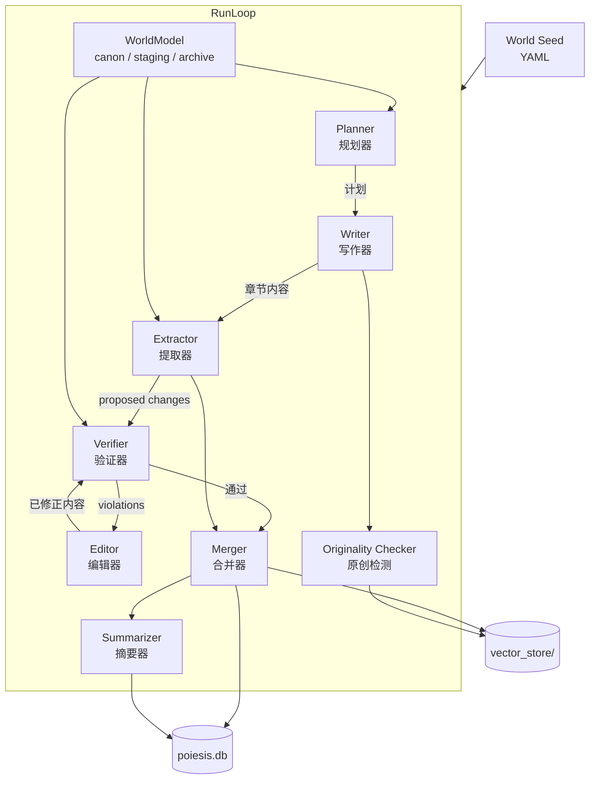

# Poiesis / 长篇叙事生成引擎
### Narrative Generation Engine for Long-Form Fiction

<p align="left">
  
  
  
  
  
</p>

> 🚀 自托管长篇叙事生成引擎（Web Console + API + Optional Embedding Service）
> 🎯 聚焦“持续一致性”而不是“一次性生成”。

Poiesis 是一个面向长篇小说与系列化叙事的开源生成系统，提供从世界观建模、章节生成、事实提取、冲突验证到内容修订的完整工作流。项目通过可审计的世界模型（`canon/staging/archive`）和多阶段 RunLoop pipeline，将“可读文本生成”升级为“可持续演进的叙事工程”。

与通用聊天式写作不同，Poiesis 重点解决长文本场景中的结构性问题：角色设定漂移、时间线冲突、设定遗忘、伏笔回收失败和多章节语义断裂。系统支持 API 与 Web Console 协同，便于团队化运营、人工审核与质量追踪。

---

## ✨ Why Poiesis / 为什么选择 Poiesis

### 项目定位 / Positioning

Poiesis 面向“需要长期稳定产出叙事内容”的个人作者与内容团队，强调生成质量的可控性、过程可追溯性与部署自主权。

### 解决的问题 / Problems Solved

- 🧠 **跨章节一致性难题**: 通过 `WorldModel` 维护角色关系、规则约束与时间线，降低设定漂移。
- 🧪 **生成质量不可控**: `Verifier + Editor` 形成闭环，自动识别违规设定并触发修订。
- 🗂️ **新事实引入风险高**: 使用 `staging -> review -> canon` 审批机制，避免错误事实直接污染主设定。
- 📉 **长流程缺乏观测**: 提供任务状态、统计与配置界面，支持运营化管理。

### 关键技术 / Key Technologies

- ⚙️ **Backend**: FastAPI + Pydantic + SQLite，提供任务编排、鉴权与配置管理。
- 🌐 **Frontend**: React + TypeScript + Vite，构建可视化控制台与运行观测能力。
- 🔄 **Pipeline**: Planner -> Writer -> Extractor -> Verifier -> Editor -> Merger -> Summarizer。
- 🧩 **Embedding Strategy**: 支持 `local`（轻量）与 `remote`（语义检索增强）两种模式。
- 🐳 **Deployment**: Docker Compose 一键部署，支持从轻量启动到完整语义能力扩展。

### 项目特点 / What Makes It Different

- 🔍 **以世界模型为中心，而非单次 Prompt**。
- 🧾 **变更可审计，便于团队协作与内容治理**。
- 🛡️ **支持人机协同审批，适合生产环境迭代**。
- 🔓 **完全自托管开源，便于二次开发与私有化部署**。

---

## 🏗️ Architecture / 系统架构

### 🧭 System Topology



### 🔄 Generation Pipeline (RunLoop)



### 🧱 Three-Layer World Model

| Layer | 内容 | 可变性 |
|---|---|---|
| `canon` | 已审批的权威世界事实 | 追加 / 更新 |
| `staging` | 来自新章节的待审改动 | 待审核 |
| `archive` | 已拒绝改动及原因 | 不可变审计日志 |

---

## 🖥️ System Requirements / 系统要求

### ⚡ 轻量模式（local embedding）最低配置

| 资源 | 最低要求 |
|---|---|
| CPU | 2 核 |
| 内存 | 2 GB |
| 磁盘 | 2 GB（镜像约 550MB + 数据目录） |

### 🚀 完整模式（remote embedding + embed 服务）推荐配置

| 资源 | 推荐配置 | 最低可用 |
|---|---|---|
| CPU | 4 核 | 2 核（较慢） |
| 内存 | 8 GB | 4 GB（可能较慢或 OOM） |
| 磁盘 | 10 GB | 含镜像约 3.5GB + 模型缓存约 90MB + 数据目录 |

---

## 🚀 Quick Start (Docker) / 快速开始（Docker）

### 1. 📦 Prepare

```bash
git clone https://github.com/djmacdtr/Poiesis.git
cd Poiesis
cp .env.example .env
mkdir -p data
```

### 2. ▶️ Start (lightweight mode, default)

```bash
docker compose pull
docker compose up -d
```

### 3. ✅ Verify

```bash
docker compose ps
curl -I http://127.0.0.1:18080/
curl -I http://127.0.0.1:18080/openapi.json
```

### 4. 🌐 Open Console

- Web: `http://127.0.0.1:18080`
- API: `http://127.0.0.1:18000`

首次进入建议流程：
1. 登录（默认账号 `admin`，密码见 `.env` 的 `POIESIS_ADMIN_PASS`）
2. 在系统设置配置 OpenAI/Anthropic Key
3. 初始化世界（UI 或 CLI）
4. 在 Run 页面设置章节数并启动任务

---

## 🎛️ Deployment Modes / 部署模式

| Mode | Command | Use Case |
|---|---|---|
| `local` (default) | `docker compose up -d` | 快速启动、低资源、离线可用 |
| `remote` (semantic) | `docker compose --profile full up -d` | 真实语义检索与更强一致性 |

完整模式需要在 `.env` 中设置：

```dotenv
POIESIS_EMBEDDING_PROVIDER=remote
POIESIS_EMBEDDING_URL=http://embed:9000
```

---

## 🛠️ Local Development (Minimal) / 本地开发（最小流程）

```bash
# Backend
pip install -e ".[dev]"
poiesis serve --config config.yaml

# Frontend
cd frontend
npm install
npm run dev
```

---

## 📚 Documentation / 文档索引

- Developer Guide: `docs/developer_guide.md`
- Frontend Guide: `frontend/README.md`
- Docker Topology: `docker-compose.yml`
- API Smoke Test: `scripts/smoke_test_api.py`

---

## 🧯 Common Issues / 常见问题

- `/api` 返回 502: 确认 `api` 容器健康且 `web` 可解析服务名 `api`
- 运行任务报缺少 Key: 在系统设置或 `.env` 补齐 LLM Key
- 选择 `remote` provider 失败: 使用 `--profile full` 启动并检查 `embed` 健康状态

---

## 🤝 Contributing / 参与贡献

参与贡献

1. Fork 本仓库并创建功能分支。
2. 如需添加新功能，请先通过 Issue 讨论需求与方案。
3. 安装开发依赖：`pip install -e ".[dev]"`
4. 安装 pre-commit 钩子：`pre-commit install`
5. 为新功能编写测试用例。
6. 确保 `ruff check poiesis tests` 和 `mypy poiesis` 通过检查。
7. 向 `main` 分支提交 Pull Request。

添加新的 LLM 提供商

参见 `docs/developer_guide.md`。

扩展验证规则

参见 `docs/developer_guide.md`。

如果喜欢本项目，欢迎点亮 Star，并通过 Issue 或 Pull Request 提交反馈与改进建议。

---

## 📄 License / 开源协议

本项目采用 GNU AGPLv3 协议：允许使用、修改与分发；若将修改版本用于对外网络服务，也需向用户提供对应源码。

GNU AGPLv3. See `LICENSE`.
